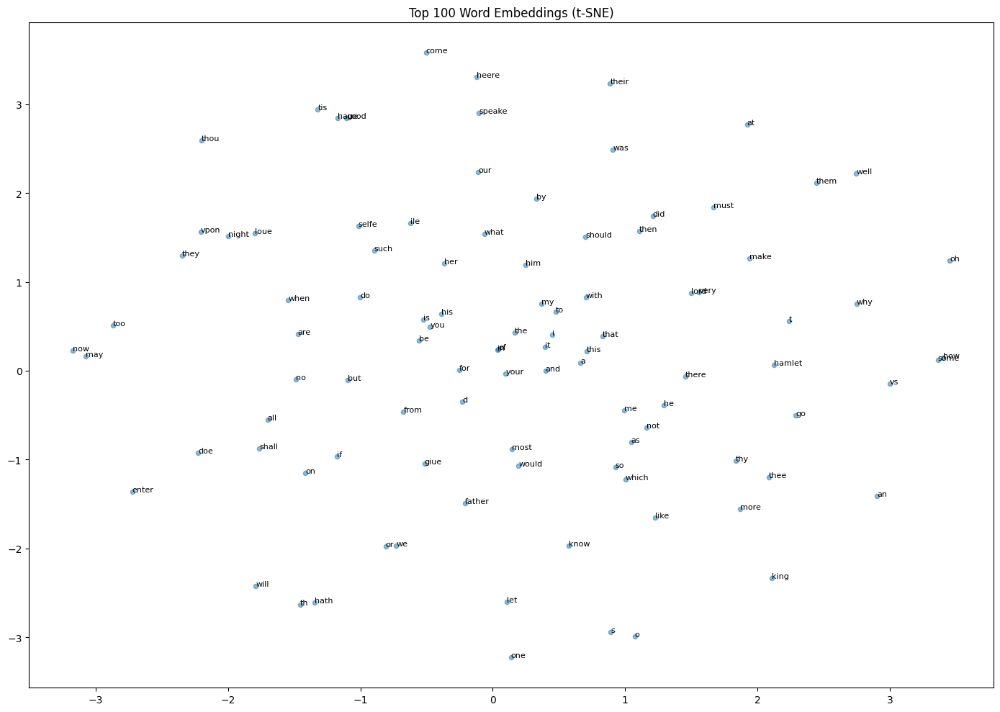

# Word2Vec in pure NumPy

Skip-Gram with Negative Sampling (SGNS), implemented from scratch using only NumPy — no PyTorch, no TensorFlow.

Trained on Shakespeare's Hamlet (NLTK Gutenberg corpus).



---

## How it works

### Skip-Gram objective

For each target word $w_t$ and context word $w_c$, the model maximizes:

$$\log \sigma(u_{w_c}^\top h) + \sum_{k=1}^{K} \mathbb{E}_{w_k \sim P_n} [\log \sigma(-u_{w_k}^\top h)]$$

where $h = v_{w_t}$ is the target word embedding (a row of $W_1$).

Instead of computing a softmax over the entire vocabulary (expensive), we use **negative sampling**: for each positive context word, we sample $K$ random "negative" words and optimize a binary classification objective.

---

### Gradients

Let $u = w_2^\top h$ be the dot product score. The loss for one (target, context) pair is:

$$\mathcal{L} = -\log \sigma(u_{pos}) - \sum_{k=1}^{K} \log(1 - \sigma(u_{neg_k}))$$

**Positive sample gradient:**

$$\frac{\partial \mathcal{L}}{\partial u_{pos}} = \sigma(u_{pos}) - 1$$

**Negative sample gradient:**

$$\frac{\partial \mathcal{L}}{\partial u_{neg}} = \sigma(u_{neg})$$

**Input embedding gradient** (accumulates signal from positive + all negatives):

$$\frac{\partial \mathcal{L}}{\partial h} = (\sigma(u_{pos}) - 1) \cdot w_{2,pos} + \sum_{k=1}^{K} \sigma(u_{neg_k}) \cdot w_{2,neg_k}$$

---

### Negative sampling distribution

Words are sampled from a smoothed unigram distribution:

$$P_n(w) = \frac{f(w)^{0.75}}{\sum_j f(j)^{0.75}}$$

The exponent $0.75$ flattens the distribution relative to raw frequency, giving rare words a higher chance of being drawn as negatives. This prevents the model from only ever contrasting against the most common words.

---

### Subsampling frequent words

Each word is kept with probability:

$$P(\text{keep} \mid w) = \min\left(1,\ \sqrt{\frac{t}{f(w)}}\right)$$

where $t = 10^{-3}$ and $f(w)$ is the relative frequency of the word. High-frequency words like *the*, *and*, *of* are discarded most aggressively, which reduces noise and speeds up training.

---

## Project structure

```
word2vec-numpy/
├── word2vec.py        # Word2Vec class (model, training, evaluation)
├── train.py           # Corpus loading, training script, t-SNE visualization
├── requirements.txt
└── assets/
    └── embedding_viz.png
```

---

## Run

```bash
pip install -r requirements.txt
python train.py
```

---

## Results

Most similar words after 100 epochs on Hamlet:

| Query   | Top matches                              |
|---------|------------------------------------------|
| hamlet  | horatio, laertes, ophelia, lord, king    |
| king    | queen, lord, polonius, hamlet, court     |
| death   | life, soul, time, heaven, fate           |

---

## Implementation notes

- Two weight matrices: $W_1$ (target embeddings, shape `[V, n]`) and $W_2$ (context embeddings, shape `[n, V]`). At inference only $W_1$ is used for similarity search.
- $W_1$ gradient is computed using the **pre-update** copy of $W_2[:, pos]$ to avoid a stale-gradient bug.
- Negative candidates are sampled in one vectorized `np.random.choice` call (`k*2` at a time) and filtered, avoiding $k$ separate calls.
- Dynamic window size: window is sampled uniformly from $[1, \text{window\_size}]$ each step, which upweights closer context words as in the original paper.
